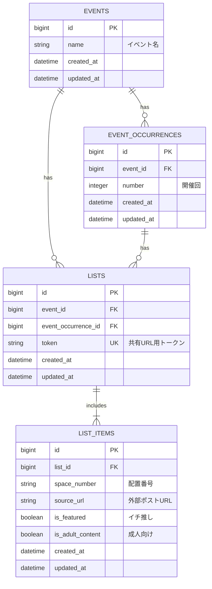

# データベース構成

## 制約

- `lists.token` は一意かつ必須
- `event_occurrences.event_id` は必須
- `event_occurrences.number` は必須
- `lists.event_id` は必須
- `lists.event_occurrence_id` はNULL許可
- `event_occurrence_id` がある場合、`lists.event_id` と同じイベントに属する
- `UNIQUE(event_id, number)` でイベント内の開催回重複を禁止する
- `UNIQUE(list_id, space_number)` で同一リスト内の配置番号重複を禁止する
- 1リストにつき巡回先は最大20件
- 1リストにつき `is_featured = true` は最大1件
- 巡回先は登録順で表示する
- ユーザー登録・ログイン機能は持たない
- 成人向けの巡回先は閲覧画面に表示しない
- 「その他」は「みんなが選んでいる配置」の集計対象外

## 集計

「みんなが選んでいる配置」は、`event_occurrences` 単位で共有URLから閲覧可能なリストの `list_items.space_number` を集計する。
