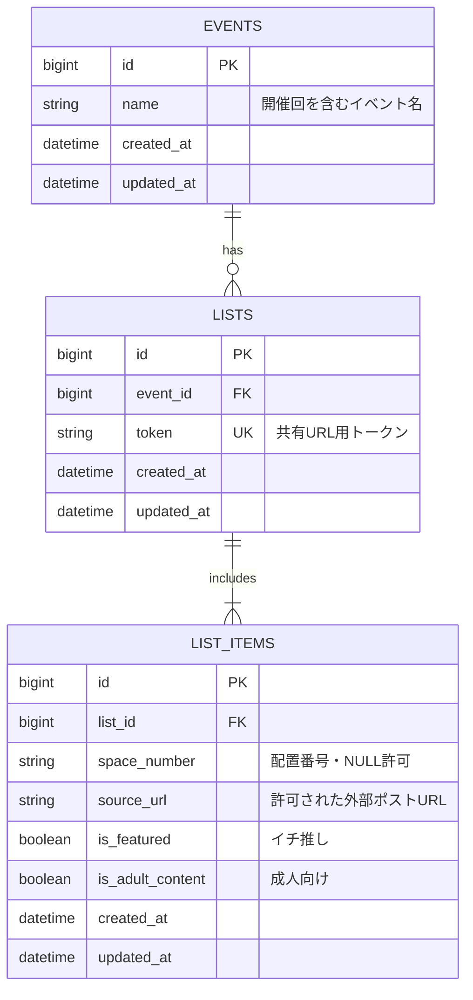

# データベース構成

## 制約

- `lists.token` は一意かつ必須
- `lists.event_id` は必須
- 入力済み配置番号の重複を禁止する
- 配置番号未入力の巡回先は登録できる
- 1リストにつき巡回先は最大20件
- 1リストにつき `is_featured = true` は最大1件
- 巡回先は登録順で表示する
- ユーザー登録・ログイン機能は持たない
- 成人向けの巡回先は閲覧画面に表示しない
- 「その他」は「みんなが選んでいる配置」の集計対象外

## 集計

「みんなが選んでいる配置」は、`events` 単位で共有URLから閲覧可能なリストの `list_items.space_number` を集計する。配置番号未入力の巡回先は集計対象外とする。
